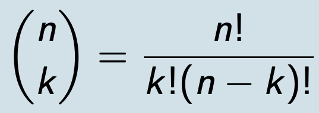

# LOGIK

## Aussagenlogik
### Elementare Aussagen
- Aussagen, die entweder wahr oder falsch sind
- Boolean variables sind elementare Aussagen
- Dinge mit Variablen, Fragen, Wünsche etc. sind keine elementaren Aussagen

### Zusammengesetzte Aussagen
Bestehen aus elementaren Aussagen, die mit logischen Verbindern kombiniert werden.

| Umgangssprache    | Symbol | logischer Name  |
| ----------------- | ------ | --------------- |
| Nicht             | `¬`    | Negation        |
| Und               | `∧`    | Konjunktion     |
| Oder              | `∨`    | Disjunktion     |
| Wenn ... dann     | `→`    | Implikation     |
| Wenn und nur wenn | `↔`    | Äquivalenz      |
| Entweder ... oder | `⊕`    | Exklusives Oder |

Wahrheitstabellen logischer Verbinder

| `P` | `Q` | `P ∧ Q` | `P ∨ Q` | `P → Q` | `P ↔ Q` | `P ⊕ Q` |
| --- | --- | ------- | ------- | ------- | ------- | ------- |
| F   | F   | F       | F       | T       | T       | F       |
| F   | T   | F       | T       | T       | F       | T       |
| T   | F   | F       | T       | F       | F       | T       |
| T   | T   | T       | T       | T       | T       | F       |

*Beispiel:* Wenn die Beeren am Wegrand reif sind (`r`), dann ist das Wandern nur dann sicher (`w`), wenn keine Bären gesichtet (`¬b`) wurden.
`r → (w ↔ ¬b)`

Wahrheitstabelle für dieses Beispiel:

| `r` | `w` | `b` | `¬b` | `(w ↔ ¬b)` | `r → (w ↔ ¬b)` | Bedeutung                                                                             |
| --- | --- | --- | ---- | ---------- | -------------- | ------------------------------------------------------------------------------------- |
| F   | F   | T   | F    | T          | T              |                                                                                       |
| F   | T   | F   | T    | T          | T              | Aussage wahr und wandern sicher:  Wenn Beeren nicht reif und keine Bären gesichtet |
| F   | T   | T   | F    | F          | T              | Aussage wahr und wandern sicher:  Wenn Beeren nicht reif und Bären gesichtet       |
| T   | F   | F   | T    | F          | F              |                                                                                       |
| T   | F   | T   | F    | T          | T              |                                                                                       |
| T   | T   | F   | T    | T          | T              | Aussage wahr und wandern sicher:  Wenn Beeren reif und keine Bären gesichtet       |
| T   | T   | T   | F    | F          | F              |                                                                                       |

### System Spezifikationen
Konsistenz: Dürfen keine Konflikte oder Widersprüche beinhalten, es muss eine Kombination für die Input Variablen geben, die alle Anforderungen erfüllt.  
*Beispiel:*  
- I. Der Ping muss schneller als 1 Sekunde sein(p) und die Seite in weniger als 2 Sekunden laden(l).
- II. Die Seite lädt nicht in weniger als 2 Sekunden oder der Ping ist nicht schneller als 1 Sekunde.

`I.  p ∧ l`  
`II. ¬l ∨ ¬p`  

Wahrheitstabelle für dieses Beispiel:

| `p` | `l` | `p ∧ l` | `¬l ∨ ¬p` |
| --- | --- | ------- | --------- |
| F   | F   | F       | T         |
| F   | T   | F       | T         |
| T   | F   | F       | T         |
| T   | T   | T       | F         |

Bedeutung: Es gibt keine Zeile, in der beide Anforderungen erfüllt sind. Darum sind diese Spezifikationen inkonsistent.  

### Charakteristiken zusammengesetzter Aussagen
Eigenschaften von zusammengesetzter Aussage P

| Name                       | Eigenschaft                                                                              | Beispiel                    |
| -------------------------- | ---------------------------------------------------------------------------------------- | --------------------------- |
| Tautologie                 | Immer wahr, egal welche Werte die Aussagen haben                                         | `a ∨ ¬a`                    |
| Kontradiktion, Widerspruch | Immer falsch, nicht erfüllbar                                                            | `a ∧ ¬a`                    |
| Erfüllbar                  | Durch mindestens 1 Kombination von Aussagenwerten erfüllt                                | `(a → b) ∧ (b → a)`         |
| Äquivalent zu Q            | Wenn die gleichen Aussagenwerte immer den gleichen Output liefern. Notation: P ≡ Q | `(a → b) ∧ (b → a) ≡ a ↔ b` |

Wenn `P ≡ Q`, dann ist `P ↔ Q` eine Tautologie

### Beweis: De Morgan's law
`¬(P ∧ Q) ≡ ¬P ∨ ¬Q`

Beweis:

| `P` | `Q` | `P ∧ Q` | `¬(P ∧ Q)` | `¬P ∨ ¬Q` |
| --- | --- | ------- | ---------- | --------- |
| F   | F   | F       | T          | T         |
| F   | T   | F       | T          | T         |
| T   | F   | F       | T          | T         |
| T   | T   | T       | F          | F         |

Die letzten 2 Spalten sind gleich, daher ist De Morgan's law wahr.

### Vereinfachen zusammengesetzter Aussagen

| Gesetz              | für  `∨`                          | für `∧`                           |
| ------------------- | --------------------------------- | --------------------------------- |
| Kommutativgesetz    | `P ∨ Q ≡ Q ∨ P`                   | `P ∧ Q ≡ Q ∧ P`                   |
| Assoziativgesetz    | `P ∨ (Q ∨ R) ≡ (P ∨ Q) ∨ R`       | `P ∧ (Q ∧ R) ≡ (P ∧ Q) ∧ R`       |
| Distributivgesetz   | `P ∨ (Q ∧ R) ≡ (P ∨ Q) ∧ (P ∨ R)` | `P ∧ (Q ∨ R) ≡ (P ∧ Q) ∨ (P ∧ R)` |
| Absorptionsgesetz   | `P ∨ (P ∧ Q) ≡ P`                 | `P ∧ (P ∨ Q) ≡ P`                 |
| De Morgans Gesetz   | `¬(P ∨ Q) ≡ ¬P ∧ ¬Q`                | `¬(P ∧ Q) ≡ ¬P ∨ ¬Q`              |
| Doppelnegativgesetz | `¬¬A ≡ A`                         |

## Prädikatenlogik
- Die Aussage, die A(x) über x macht nennt man Prädikat.

*Beispiele:*

| Aussagenfunktion    | Variable | Prädikat    | Wahr für x        | Falsch für x     |
| ------------------- | -------- | ----------- | ----------------- | ---------------- |
| `A(x): x < 100`     | `x`      | `< 100`     | `1`,`99`          | `100`, `999`     |
| `B(x,y): x + y = 0` | `x`,`y`  | `x + y = 0` | `x = 1`, `y = -1` | `x = 1`, `y = 1` |

Aussagefunktionen
- können mit logischen Verbindern kombiniert werden
- hängen mit ihrem Wahrheitsgehalt vom Wert der Variablen ab
- können von mehreren Variablen abhängen
- werden zur Aussage, wenn man
  - die Variable(n) durch feste(n) Wert(e) erstetzt
  - mittels eines Quantors eine Aussage formt

### Quantoren
Universalquantor
- "für alle"
- Notation: `∀x ∈ X : P(x)`
- auch: Allaussage, Allquantor
- Positivbeweis: Alle möglichen Werte prüfen
- Negativbeweis: Ein Gegenbeispiel finden

Existenzquantor
- "es existiert mindestens einer"
- Notation: `∃x ∈ X : P(x)`
- Positivbeweis: Ein Beispiel finden
- Negativbeweis: Alle möglichen Werte prüfen

#### Negation quantifizierter Ausdrücke
Das Gegenteil von `Jeder liebt Mathematik` 
ist `Es gibt mindestens eine Person, die Mathematik nicht liebt` 
(und nicht `Niemand liebt Mathematik`).

De Morgans Gesetz für Quantoren:  
`¬(∀x ∈ X : A(x)) ≡ ∃x∈X : ¬A(x)`  
`¬(∃x∈X : A(x)) ≡ ∀x∈X : ¬A(x)`  

#### Verschachtelte Quantoren
Die Reihenfolge von Quantoren kann nicht einfach vertauscht werden!  
*Beispiel:*  
`Q(x, y, z) : x + y = z`
dann gibt es einen Unterschied zwischen  
`∀x ∀y ∃z Q(x, y, z)` => Für alle Kombinationen aus `x` und `y` existiert ein `z`, welches die Summe der beiden ist
und  
`∃z ∀x ∀y Q(x, y, z)` => Es existiert ein `z`, welches die Summe aus allen denkbaren `x` und `y` bildet.

#### Negation verschachtelter Quantoren
Nutze De Morgans Gesetz und gehe von links nach rechts, bis du das Prädikat erreichst.  

#### Logik höherer Ordnung
- Wenn Prädikate Prädikate haben können.
- Beispiel: *Higher order functions* in Scala (Funktionen als Parameter für Funktionen)

## Ableitungsregeln

*Beispiel:*  
Sherlock Holmes im Rätsel um das gestohlene Rennpferd "Silver Blaze":
- Das Pferd verschwand aus einem Stahl, welcher von einem Wachhund bewacht wurde
- Der Wachhund bellt laut, wenn er einen Fremden sieht
- Der Wachhund bellte nicht laut  
=> Also kannte der Wachhund den Dieb  

*Beispiel:*  
Sokrates ist ein Mensch.  
Wenn Sokrates ein Mensch ist, dann ist Sokrates sterblich.  
∴ Sokrates ist sterblich

### Definitionen
- Ein **Argument** ist eine Sequenz von Aussagen 
- ∴ bedeutet **deshalb**
- Eine **Schlussfolgerung** ist eine Sequenz von zusammengesetzten Aussagen, die in einer Konklusion münden
- Eine Schlussfolgerung ist valide, wenn (und nur wenn) ihre Aussagen wahr sind und auch die Konklusion wahr machen. *In anderen Worten: Die Wahrheit einer Konklusion folgt unausweichlich aus der Wahrheit der Prämissen. Es ist unmöglich, eine valide Schlussfolgerung mit wahren Prämissen zu haben, deren Konklusion falsch ist.*

### Schlussfolgerung validieren
Zwei Wege:
1. Nutze eine Wahrheitstabelle und zeige, dass wenn alle Prämissen wahr sind, die Konklusion auch wahr ist. *Problem:* Dauert lange (`2^n` Zeilen)
2. Kombiniere einfache Schlussfolgerungen. *Problem:* Schwierig zu beweisen, dass eine Schlussfolgerung falsch ist.

#### Modus Ponens

`p → q`  
`p`  
∴ `q`

*Beispiel:* Wenn du ein Passwort hast, dann kannst du dich einloggen. Du hast ein Passwort. Also kannst du dich einloggen.  

Wahrheitstabelle zur Validierung des Modus Ponens:

| `p` | `q` | `p → q` |                                                                              |
| --- | --- | ------- | ---------------------------------------------------------------------------- |
| F   | F   | T       |                                                                              |
| F   | T   | T       |                                                                              |
| T   | F   | F       |                                                                              |
| T   | T   | T       | Die Prämissen `p → q` und `p` sind wahr, die Konklusion `q` ist auch wahr |

#### Komplizierteres Beispiel

`p → q ∨ ¬r`  
`q → p ∧ r`  
∴ `p → r`  

Wahrheitstabelle dazu:

| `p` | `q` | `r` | `q ∨ ¬r` | `p ∧ r` | `p → q ∨ ¬r` | `q → p ∧ r` | `p → r` |                                                                                 |
| --- | --- | --- | -------- | ------- | ------------ | ----------- | ------- | ------------------------------------------------------------------------------- |
| F   | F   | F   | T        | F       | T            | T           | T       |                                                                                 |
| F   | F   | T   | F        | F       | T            | T           | T       |                                                                                 |
| F   | T   | F   | T        | F       | T            | F           | T       |                                                                                 |
| F   | T   | T   | T        | F       | T            | F           | T       |                                                                                 |
| T   | F   | F   | T        | F       | T            | T           | F       | Prämissen sind wahr, Konklusion ist falsch.  Daher invalide Schlussfolgerung |
| T   | F   | T   | F        | T       | F            | T           | T       |                                                                                 |
| T   | T   | F   | T        | F       | T            | F           | F       |                                                                                 |
| T   | T   | T   | T        | T       | T            | T           | T       |                                                                                 |

#### Modus tollens

`¬q`  
`p → q`  
∴ `¬p`

*Beispiel:* Wenn du kein Passwort hast, und du ein Passwort brauchst, um dich einzuloggen, dann kannst du dich nicht einloggen.

#### Ableitungsregeln für Aussagenlogik

| Ableitungsregel                  | Tautologie                       | Name                       | Beispiel                                                                                                                                                           |
| -------------------------------- | -------------------------------- | -------------------------- | ------------------------------------------------------------------------------------------------------------------------------------------------------------------ |
| `p → q` `p` ∴ `q`          | `(p ∧ (p → q)) → q`              | Modus Ponens               | Wenn du ein Passwort hast,  dann kannst du dich einloggen.  Du hast ein Passwort.  Also kannst du dich einloggen.                                         |
| `¬q` `p → q` ∴ `¬p`        | `(¬q ∧ (p → q)) → ¬p`            | Modus Tollens              | Wenn du kein Passwort hast,  und du ein Passwort brauchst, um dich einzuloggen,  dann kannst du dich nicht einloggen.                                        |
| `p → q` `q → r` ∴ `p → r`  | `((p → q) ∧ (q → r)) → (p → r)`  | Hypotethischer Syllogismus | Wenn die Sonne scheint, grillen wir.  Wenn wir grillen, werden wir satt.  Die Sonne scheint.  Daher werden wir Satt, wenn die Sonne scheint.              |
| `p ∨ q` `¬q` ∴ `q`         | `((p ∨ q) ∧ ¬p) → q`             | Disjunktive Syllogismus    | Wenn einer von uns beiden gekocht hat,  und ich habe nicht gekocht,  dann hast du gekocht.                                                                   |
| `p` ∴ `p ∨ q`                 | `p → (p ∨ q)`                    | Addition                   | Es friert.  Daher friert es, oder es regnet.                                                                                                                    |
| `p ∧ q` ∴ `p`                 | `(p ∧ q) → p`                    | Vereinfachung              | Es friert und regnet.  Daher friert es.                                                                                                                         |
| `p` `q` ∴ `p ∧ q`          | `((p) ∧ (q)) → (p ∧ q)`          | Konjunktion                | Es friert. Es regnet. Also friert und regnet es.                                                                                                                   |
| `p ∨ q` `¬q ∨ r` ∴ `q ∨ r` | `((p ∨ q) ∧ (¬q ∨ r)) → (p ∨ r)` | Auflösung                  | Es ist schlecht beschrieben  oder ich bin dumm.  Ich bin nicht dumm  oder ich bin sehr dumm. Also ist es schlecht beschrieben  oder ich bin sehr dumm. |

#### Anwendung des Ableitungsregeln
Für kompliziertere Argumente mit mehreren Prämissen, welche nicht direkt zu den obigen korrespondieren:
1. Nutze eine Ableitungsregel, um eine vorläufige Konklusion aus einer oder mehreren Prämissen (oder schon vorhandenen vorläufigen Konklusionen) abzuleiten.
2. Wiederhole bis eine gewünschte Konklusion erreicht wird.  

*Beispiel:* Prämissen:
1. Es ist sonnig und heiß. `s ∧ h`
2. Wenn es sonnig ist, trage ich eine Sonnenbrille. `s → b`
=> Konklusion: Ich trage eine Sonnenbrille. `b`

`s ∧ h`  
`s → b`  
∴ `b`

Mittels Vereinfachung `s ∧ h` → `s` zu Modus Ponens:  
`s`  
`s → b`  
∴ `b`  
*Schlussfolgerung:* Das Argument ist valide. Ich trage einen Sonnenbrille. 😎  

#### Ableitungsregeln für quantifizierte Ausdrücke

| Name                          | Ableitungsregel                        | Erklärung                                                                                                                      |
| ----------------------------- | -------------------------------------- | ------------------------------------------------------------------------------------------------------------------------------ |
| Universelle Instanziierung    | `∀x P(x)` ∴ `P(c)`                  | Wenn eine Eigenschaft für  alle Werte einer Gruppe wahr ist,  dann ist jeder konkrete Wert dieser Gruppe wahr.           |
| Universelle Generalisierung   | `P(c)` für beliebiges c ∴ `∀x P(x)` | Wenn eine Eigenschaft für  einen beliebigen Wert einer Gruppe wahr ist,  dann ist sie für alle Werte wahr.               |
| Existenziellle Instanziierung | `∃x P(x)` ∴ `P(c)` für ein c        | Wenn ein Wert existiert,  für den eine Eigenschaft wahr ist,  dann ist diese Eigenschaft für einen bestimmten Wert wahr. |
| Existenzielle Generalisierung | `P(c)` für ein c ∴ `∃x P(x)`        | Wenn eine Eigenschaft für  einen bestimmten Wert wahr ist,  dann existiert ein Wert, für den diese Eigenschaft wahr ist. |

*Beispiel:* `Jeder im Kurs hat einen Bachelor` und `Robert ist im Kurs`  
Nutzung der universellen Instanziierung: `Robert hat einen Bachelor`  

### Ableitungsmaschinen (Inference Engines)
Ableitungsmaschinen ermöglichen:
- **Forward Chaining**: Deduktion neuer Information aus Wissensdatenbank 
- **Backward Chaining**: Beweise finden durch Etablierung valider Ketten und Auffinden notwendiger Prämissen in der Wissensdatenbank 
[Mehr darüber hier.](http://aima.eecs.berkeley.edu/slides-pdf/chapter09.pdf)

## Beweisprinzipien

### Terminologie
- Satz/Theorem: Ein Ausdruck, der als wichtig erachtet wird und bewiesen werden kann. Beispiel: Satz des Pythagoras.
- Axiom: Ein Ausdruck, der für wahr gehalten wird.
- Beweis: Ein valides Argument das die Wahrheit eines Satzes belegt. Besteht aus:
  - Axiomen (den Prämissen des Satzes)
  - Bereits bewiesenen Sätzen
  - Ableitungsregeln, welche die Konklusion des Satzes daraus herleiten
- Lemma: Wenig wichtiger Satz, der als Baustein eines wichtigeren Satzes fungiert.
- Korollar: Ein Satz, der direkt von einem anderen Satz, welcher bewiesen wurde, abgeleitet werden kann.
- Vermutung: Ein Ausdruck, der als wahr vermutet wird, aber noch nicht bewiesen werden konnte. Wird eine Vermutung bewiesen, so wird ein Satz daraus.  

### Beweismethoden
- Direkter Beweis: Beweist einen Satz `p → q` durch die Annahme, das `p` wahr ist, und durch Zeigen, dass `q` dann auch wahr sein muss.
- Indirekter Beweis/Kontraposition: Beweist einen Satz `p → q` durch Zeigen, dass `¬q → ¬p` wahr ist (mittels direktem Beweis).
- Widerspruchsbeweis/Kontradiktion: Beweist das `p` wahr ist, indem man `¬p` annimmt, und dann einen logischen Widerspruch erzeugt. "Reductio ad absurdum"
- Induktionsbeweis: Beweist das `P(n)` für alle `n` wahr ist, indem man `P(0)` beweist und dann zeigt, dass `P(k) → P(k + 1)` für beliebiges `k` auch wahr ist. `n` ist ein Teil einer rekursiv definierten Gruppe, z.B. der natürlichen Zahlen.
- [...weitere Methoden](https://en.wikipedia.org/wiki/Mathematical_proof)  

### Beispiel: direkter Beweis
Wenn `n` eine ungerade Zahl ist, dann ist `n^2` ungerade.  Direkter Beweis:  
1. Übersetze `n ist ungerade` zu `n = 2k +1` für `k ∈ Z`
2. `n = 2k +1` ist wahr
3. `n^2 = (2k +1)^2` wird zu
4. `n^2 = 4k^2 + 4k + 1` mittels 1. bin. Formel
5. Ersetze `2k^2 + 2k` mit `m`
6. `n^2 = 2m + 1`
7. und das bedeutet, `n^2` ist auch ungerade

# KOMBINATORIK

## Zählen

### Summenregel

*Beispiel:* Jemand kann sich ein Projekt aus drei Listen auswählen. Die erste Liste hat 3 Einträge, die zweite hat 5 Einträge und die dritte hat 9 Einträge. Keines der Projekte kommt in mehreren Listen vor.

Die Person kann sich also zwischen 3 + 5 + 9 = 17 Projekten entscheiden.

Definition:

`|A1 ∪ A2 ∪ . . . ∪ Ak|` = `|A1| + |A2| + ... + |Ak|`  

|A| = Anzahl der Elemente der Menge A
∪ = Vereinigung, also ODER
*Das funktioniert nur für disjunkte Mengen, also dürfen sich keine Elemente doppeln*

### Produktregel

*Beispiel:* Es gibt 3 unterschiedliche Routen von Konstanz nach München und 4 unterschiedliche Routen von München nach Wien.

Also gibt es 3 * 4 = 12 unterschiedliche Routen von Konstanz über München nach Wien.

Definition:

`|A1 × A2 × ... × Ak|` = `|A1| * |A2| * ... * |Ak|`  
In anderen Worten: Die Anzahl der kombinierten Möglichkeiten ist das Produkt der Möglichkeitengruppen.

*Beispiel:* Eine Telefonnummer besteht aus diesem Muster:  
`NYX-NNX-XXXX` mit `N ∈ {2 .. 9}`, `X ∈ {0 .. 9}`, `Y ∈ {0, 1}`  

Wie viele unterschiedliche Telefonummern kann es geben?

*Lösung:*  
`|N| = 8`, `|X| = 10`, `|Y| = 2`

`|N| * |Y| * |X| * |N| * |N| * |X| * |X| * |X| * |X| * |X|`

= `8 * 2 * 10 * 8 * 8 * 10 * 10 * 10 * 10 * 10`

= __`1_024_000_000`__

### Das Einschluss-Ausschluss Prinzip
*Beispiel:* In einer Stadt mit 1000 Einwohnern sprechen 90% Deutsch und 50% Englisch.
Also sprechen 400 Einwohner beide Sprachen, da

`90% von 1000 = 900`

`50% von 1000 = 500`

`900 + 500 - 1000 = 400`

Definition für 2 Mengen:

`|A1 ∪ A2|` = `|A1| + |A2| - |A1 ∩ A2|`

Also in anderen Worten: Die Größe der Vereinigung von 2 Mengen ist die Summe der Größen der beiden Mengen minus die Größe der Schnittmenge der beiden Mengen.

Definition für 3 Mengen:

`|A1 ∪ A2 ∪ A3|`  
= `|A1| + |A2| + |A3| - |A1 ∩ A2| - |A1 ∩ A3| - |A2 ∩ A3| + |A1 ∩ A2 ∩ A3|`

In anderen Worten: Alle zusammenrechnen, die 2-er Schnittmengen abziehen und die Gesamtvereinigung drauf rechnen.
*Das gibt es auch für mehr Mengen, ist aber schwieriger darzustellen.*

Das Einschluss-Ausschluss Prinzip ist eine Verallgemeinerung der Summenregel.

## Taubenschlagprinzip

Wenn es mehr Tauben als Taubenschläge gibt, dann gibt es mindestens einen Taubenschlag, in dem mindestens zwei Tauben sitzen.

Wie viele Tauben sitzen mindestens in einem Taubenschlag? = Aufrunden(`Anzahl der Tauben / Anzahl des Boxen`)

### Ramsey Theorem

*Beispiel:* Auf einer Feier mit 6 Gästen ist jeder Gast mit jedem anderen Gast entweder befreundet oder verfeindet. Dann sind immer mindestens 3 Leute (paarweise) miteinander befreundet oder verfeindet, denn
aus der Sicht einer bestimmten Person hat man entweder mindestens 3 Freunde oder 3 Feinde auf der Party. (Nach Taubenschlag: 5 Personen die in 2 Kategorien gehören können).

Im Fall von mindestens 3 Freunden gilt, dass
- wenn mindestens 2 von ihnen untereinander auch Freunde sind, dann gibt es bereits 3 Leute, die paarweise miteinander befreundet sind.
- wenn keine 2 von ihnen untereinander befreundet sind, dann existiert ebenfalls eine Menge von 3 Leuten, die miteinander (paarweise) verfeindet sind.

Im Fall von mindestens 3 Feinden funktioniert der Beweis analog.

Ramsey Zahlen sind eine Verallgemeinerung des Beispiels, welches eine Mindestanzahl von Leuten definiert,

damit mindestens `m` Leute miteinander befreundet und `n` Leute verfeindet sind.
Hier: R(3,3) = 6

## Permutationen und Kombinationen
### Permutationen
*Beispiel:* Zehn Bücher werden in einem Regal angeordnet, also gibt es

`10 * 9 * 8 * 7 * 6 * 5 * 4 * 3 * 2 * 1` = `10!` = _`3_628_800`_

Möglichkeiten, denn für den ersten Platz kommen 10 Bücher in Frage, für den zweiten Platz 9 etc.

*Beispiel*
Die ersten 3 Plätze des Marathons werden üblicherweise durch die bereits bekannten 10 besten Läufer belegt. Also gibt es

`10 * 9 * 8` = `720`

Möglichkeiten für das Siegerpodest.

Definition: Eine Permutation ist eine Menge von unterschiedlichen Elementen in einer sortierten Reihenfolge.
Im Marathon-Beispiel nennt man die Permutation eine 3-Permutation der 10 besten Läufer.

Die mögliche Anzahl für Permutationen ist

`P(n,k) = n * (n -1) * (n - 2) * ... * (n - k + 1)`

=> `P(n,k)` = `n! / (n - k)!`

`k` ist die Größe des Siegerpodest  
`n` ist die Anzahl der in Frage kommenden Läufer

`10! / (10 - 3)!`

= `10! / 7!`

= `10 * 9 * 8`

= __`720`__

*Beispiel:*
Wie viele Permutationen existieren für die Buchstabenfolge `ABCDEFGH`, in denen `ABC` vorkommt?

Lösung: `ABC` wird als ein Objekt gesehen, die anderen 5 Buchstaben als individuelle Objekt. Also existieren 6 Objekte, die beliebig angeordnet werden können. 

`6!` = `720`

### Kombinationen
*Beispiel:* Ein Eisverkäufer bietet Eisbecher mit 3 unterschiedlichen Kugeln aus 40 unterschiedlichen Sorten darin an. Wie viele unterschiedliche Eisbecher gibt es, wenn die Reihenfolge der Kugeln egal ist?

Würde die Reihenfolge eine Rolle spielen, so wären es `40! / (40 - 3)!` = `59_280` Permutationen.

Da sie das nicht tut, wurde jede Kombination `3!` = `6` mal zu häufig gezählt, also gibt es `59_280 / 3!` = `9880` unterschiedliche Kombinationen. 

Definition: Wenn es um eine ungeordnete Untermenge mit Größe k von einer Menge der Größe n geht, ist es eine k-Kombination (aus n Elementen).

`C(n, k)` = `P(n,k) / k!`

=> `C(n, k)` = `n! / (k! * (n - k)!)`

### Binomialkoeffizient

Man sagt: n über k

*Beispiel:* Von 10 Äpfeln haben 3 einen Wurm. Du nimmst 5 für den Apfelkuchen. Wie viele Möglichkeiten gibt es, genau 2 Äpfel mit Wurm in deinem Kuchen zu haben.

Lösung:

A = Anzahl der Möglichkeiten für 2 der 3 (aus 10) Äpfel mit Wurm = `C(3,2)`

B = Anzahl der Möglichkeiten für 3 der 7 (aus 10) Äpfel ohne Wurm = `C(7,3)`

`A * B`

= `C(3,2)` * `C(7,3)` (Produktregel!)

= `105`

### Permutationen mit Zurücklegen
*Beispiel:* In einer zufällig abgespielten Playlist sind 10 Lieder, welche auch mehrfach vorkommen dürfen. Daher gibt es für die ersten fünf Lieder `10 * 10 * 10 * 10 * 10` = `100_000` unterschiedliche Möglichkeiten.

Ein geordneter Satz von k Objekten aus einer Menge der Größe n nennt man k-Permutation mit Zurücklegen.

Anzahl der k-Permuationen mit Zurücklegen: `P(n,k) = n^k`

Es darf `k > n` sein.

### Kombinationen mit Zurücklegen
*Beispiel:* Man würfelt mit zwei Würfeln. Die höhere Zahl (bei Pasch eine beliebige Zahl) stellt den "Zehner" und die kleinere Zahl den "Einer", z.B. 5 und 4 wird zu 54, 6 und 6 zu 66. Wie viele unterschiedliche Werte können auftauchen?

P mit R(6,2) würde 36 ergeben, allerdings sind dann manche Werte mehrfach vorhanden (da eine Permutationen unterschiedliche Reihenfolgen zählt, was hier egal ist.)

Von Hand:
- Ist ein Würfel eine 1, gibt es 6 Möglichkeiten für den anderen.
- Ist ein Würfel eine 2, gibt es 5 Möglichkeiten für den anderen, denn 1|2 wurde schon im ersten Fall abgebildet.
- ...

=> `6 * 5 * 4 * 3 * 2 * 1 = 21`

Eine ungeordnete Auswahl von k Elementen aus einer Menge der Größe n, nennt man k-Kombination mit Zurücklegen.

Anzahl der k-Kombinationen mit Zurücklegen: `C(n,k)` 

= `n + k - 1 über k`

= `(n + k - 1)! / (k! * (n - 1)!)`

*Beispiel:* Gummibärchentüte mit 5 unterschiedlichen Gummibärchen, aus der 5 Gummibärchen gezogen werden.

= `n = 5, k = 5`

= `(5 + 5 - 1)! / 5! * (5 - 1)!`

= `9! / 5! * 4!`

= `362880 / (120 * 24)`

= `126`

### Entscheidungsbaum für Kombinationen und Permutationen
Werden alle Elemente angeordnet?

- Nein
  - Ist die Reihenfolge wichtig?
    - Ja - Variation
      - Mit Zurücklegen?
        - Ja - `n^k`
        - Nein - `n! / (n - k)!`
    - Nein - Kombination
      - Mit Zurücklegen?
        - Ja - `(n + k - 1) über k`
        - Nein - `n über k`
- Ja
  - Mit Zurücklegen?
    - Ja - `n!`
    - Nein - `n! / (l1! * l2! * ... * lk!)`

# Zahlentheorie

## Ganzzahlige Division

### Teilen und Teiler

*Beispiele der 3. Klasse:*

5 Leute teilen sich einen Kasten Bier (20 Flaschen). Also kriegt jeder 4 Flaschen (20 / 5 = 4).

3 Leute teilen sich einen Kasten Bier (20 Flaschen). Also kriegt jeder 6 Flaschen, und 2 Flaschen bleiben übrig.

Bei ganzen Zahlen teilt eine Zahl die andere (bzw. ist ein Teiler dieser Zahl), wenn das Ergebnis selbst eine ganze Zahl ist. 

Schreibweise: `5 | 20` (5 teilt 20) oder `3 /| 20` (3 teilt 20 nicht, den Strich durchstreichen)

### Eigenschaften von Teilern

Seien `n` und `d` positive ganze Zahlen.

Dann gibt es `Abrunden(n/d)` viele positive ganze Zahlen, die `n` nicht überschreiten und durch `d` teilbar sind.

*Beispiel:*

`n = 100`, `d = 3`

= `Abrunden(100 / 3)`

= `Abrunden(33,3...)`

= `33` 

## Modulo

### Division mit Rest

Satz: Für jedes `a ∈ Z` und `m ∈ N` gibt es eindeutige Zahlen `q ∈ Z` und `r ∈ N0` mit `0 ≤ r < m`, so dass

`a = m * q + r`

`a` = Divident (Das Zu-teilende), `m` = Divisor (Durch was geteilt wird)

`q` = Quotient (Ergebnis der Teilung), `r` = Rest

Mit anderen Worten: Bei einer Teilung gibt es immer genau ein Ergebnis, welches aus Quotient und Rest besteht.

Für feste `m` werden die Funktionen `div` und `mod` so definiert:

`r = a mod m`

`q = a div m`

*Beispiele:*
`17 mod 5: 3 * 5 + 2 also 2`

`-17 mod 5: -4 * 5 + 3 also 3`

`3 mod 5: 0 * 5 + 3 also 3`

`-3 mod 5: -1 * 5 + 2 also 2`

[Guter Onlinerechner für ganzzahlige Division und Rest](https://www.symbolab.com/solver/modulo-calculator)

### Kongruenz

Wenn 2 ganze Zahlen `a` und `b`, die durch `m` geteilt werden, den gleichen Rest haben, dann sind sie zueinander __kongruent__ für diesen Divisor.

Schreibweise: 

Kongruenz: `a ≡ b (mod m)`

Nicht-Kongruenz: `a /≡ b (mod m)` (das Kongruenzsymbol durchstreichen)

Diese Schreibweise beschreibt ein Verhältnis, im Gegensatz zur Funktion `r = a mod m`

*Beispiele:*

`22 ≡ 17 (mod 5)`, da `22 mod 5 = 2` und `17 mod 5 = 2`

`22 /≡ 17 (mod 54)`, da `22 mod 4 = 2` und `17 mod 4 = 1`

2 ganze Zahlen `a` und `b` und die natürliche Zahl `m` sind nur kongruent, wenn es eine ganze Zahl `k` gibt, so dass
1. `a`-`b` = `k * m`
2. `a` = `b + k * m`

*Beispiele:*

`a = 17`

`b = 5`

`m = 6`

`17 - 5 = k * 6`

= `12 = k * 6` wahr für `k = 2` => kongruent

`a = 24`

`b = 14`

`m = 6`

`24 = 14 + k * 6`

= `10 = k * 6` falsch => nicht kongruent

### Restklassen

Wenn zwei ganze Zahlen `a` und `b` für ein `m` kongruent sind, dann herrscht eine Äquivalenzbeziehung zwischen ihnen, d.h. sie sind
- symmetrisch (man kann sie vertauschen)
- reflexiv (d.h. wenn `a` und `b` die gleiche Zahl ist, ist es immer kongruent)
- transitiv (d.h. wenn `a` und `b` zueinander kongruent sind und `b` und `c` zueinander kongruent sind, dann sind auch `a` und `c` zueinander kongruent).

Durch die Äquivalenz entstehen die Restklassen `Rm`, z.B. für `m = 5`

`[0]5 = {..., -10, -5, 0, 5, 10, ...}`

`[1]5 = {..., -9, -4, 1, 6, 11, ...}`

`[2]5 = {..., -8, -3, 2, 7, 12, ...}`

`[3]5 = {..., -7, -2, 3, 8, 13, ...}`

`[4]5 = {..., -6, -1, 4, 9, 14, ...}`

=> alle ganzen Zahlen `a`, die `a mod m = 0` ergeben.  

Die Menge `Zm` = `{0, 1, 2, ..., m - 1}`
- Repräsentiert die entsprechenden Restklassen, da die Restklassen danach wieder von vorne anfangen, z.B. `[0]5 = [5]5`
- Bildet die Menge der möglichen Restwerte

*Lifehack*: Wenn man Modulorechnung beschleunigen will, kann man sich kleinere Repräsentanten der gleichen Äquivalenzklasse suchen.

### Algebraische Strukturen mit Rest

`(a + b) mod m` = `a (+m) b`

`(a * b) mod m` = `a (*m) b`

bzw.

| `(+3)` |   0   |   1   |          2           |
| :----: | :---: | :---: | :------------------: |
|   0    |   0   |   1   |          3           |
|   1    |   1   |   2   |          0           |
|   2    |   2   |   0   | 1 (da `2 + 2 mod 3`) |

Fun Fact: 0 ist das neutrale Element

Inverses Elemtent: Was uns wieder zur 0 zurückbringt bzw. zu jedem `x` gibt es ein `-x`. Schreibweise auch: `x^-1`

Wenn `d` das additive Inverse von `e` ist, dann gilt:

`e (+m) d = 0`

= `d = m - e` (falls `e != 0`, sonst `d = 0`)

z.B. `2 = 3 - 1`

In diesem Beispiel: 1 und 2

| `(*3)` |   0   |   1   |          2           |
| :----: | :---: | :---: | :------------------: |
|   0    |   0   |   0   |          0           |
|   1    |   0   |   1   |          2           |
|   2    |   0   |   2   | 1 (da `2 * 2 mod 3`) |

Fun Fact: 1 ist das neutrale Element

Inverses Element: Was uns wieder zur 1 zurückbringt z.B. 2 und 2

Existiert immer, wenn `e` und `m` teilerfremd sind (also es keine natürliche Zahl außer 1 gibt, die beide Zahlen teilt, ist bei Primzahlen immer der Fall). 

`(Zm, (+m), (*m))` ist ein Restklassenring aber kein Restklassenkörper, da die inversen Elemente der Multiplikation fehlen. Anderer Zahlenring sind die ganzen Zahlen.

Ein Restklassenring befolgt teilweise die gewohnten Rechenregeln, aber nicht alle. Befolgt:
- Assoziativgesetz für + und * (z.B. `(a * b) * c` = `a * (b * c)`)
- Distributivgesetz (`a * b + a * c` = `a * (b + c)`)
- Neutrales Element existiert
- Additives Inverses existiert, aber kein Multiplikatives Inverses für jede Zahl.

Befolgt nicht manche Eindeutigkeitssätze.

Ist `m` eine Primzahl, dann ist es darüber hinaus ein Restklassenkörper.

Ein Restklassenkörper ist eine Menge, in der alle Rechengesetze wie gewohnt gelten. Andere Beispiele sind Reele Zahle, Komplexe Zahlen etc.

`5 (+7) 3` = `(5 + 3) mod 7` = `1`

`3 (*7) 5` = `(3 * 5) mod 7` = `1`

### Verschiebealgorithmus

Um Multiplikatives Inverses zu finden.

Was ist das Inverse von `4` in `Z9`?

`1/4` ist keine ganze Zahl, also Zähler `+ 9`

`10/4` = `2,5` ist keine ganze Zahl, also Zähler `+ 9`

`19/4` = `4,75` ist keine ganze Zahl, also Zähler `+ 9`

`28/4` = `7` ist **eine** ganze Zahl, also `4^-1 in Z9` = `7`

Test: `7 (*9) 4` = `28 mod 9` = `1` ⬅️ neutrales Element ✅

Fun Facts:

`0` hat nie ein multiplikatives Inverses.

`1` ist immer sein eigenes multiplikatives Inverses (d.h. für jedes `m` gibt es ein Inverses für die 1, nämlich 1).

Die multiplikativen Inversen sind **immer eindeutig** wenn sie existieren. Das ist gut, wenn man nach dem Inversen sucht, und Zahlen ausschließen kann, weil sie bereits multiplikative Inverse anderer Zahlen in Z sind.

### Rechnen mit kongruenten Zahlen
Wenn `a ≡ b mod m` und `c ≡ d mod m`, dann

`a + c ≡ b + d mod m` bzw. `(a + b) mod m` = `((a mod m) + (b mod m)) mod m`

`a * c ≡ b * d mod m` bzw. `(a * b) mod m` = `((a mod m) * (b mod m)) mod m`

Man kann also bei Addition und Multiplikation auch erst die Bestandteile Modulorechnen und dann die Ergebnisse miteinander addieren/multiplizieren und dann nochmal Modulorechnen.

*Beispiel*:

`7 ≡ 2 mod 5` und `11 ≡ 1 mod 5`

=> `2 + 1 mod 5` = `3 mod 5` = `3`

oder für Multiplikation

=> `2 * 1 mod 5` = `2 mod 5` = `2`

Die Formel stimmt allerdings **nicht**, wenn `a`, `b`, `c` oder `d` ≡ 0 sind. Dann würde man durch 0 teilen, was nicht erlaubt ist.

## Zahlenrepräsentation

Es gibt unterschiedliche Repräsentationen *wow*

Im Dezimalsystem 123,456 bedeutet eigentlich

`1 * 10^2 + 2 * 10^1 + 3 * 10^0 + 4 * 10^-1 + 5 * 10^-2 + 6 * 10^-3`

### Umrechnung ins Dezimalsystem

1. Zahl wie oben zerlegen
2. Ausrechnen

*Beispiel*: 45,4 im Oktalsystem

1. `4 * 8^1 + 5 * 8^0 + 4 * 8^-1`
2. = `4 * 8 + 5 + 4 * 1/8` = `37,5`

### Umrechnung aus Dezimalsystem in ein anderes System
1. `b = Basis des anderen Zahlensystems`
2. `n1` ist die Zahl vor dem Komma
3. `n2` ist 0,die Zahl nach dem Komma
4. Vor dem Komma
   1. Teile `n1` durch `b`
   2. Nimm den Rest dieser Division als Stelle (ganz rechts) der neuen Zahl
   3. Wiederhole mit dem Ergebnis der Division, bis das Ergebnis der Division 0 ist
5. Hinter dem Komma
   1. Multipliziere `n2` mit `b`
   2. Notiere die Zahl **vor** dem Komma und setze sie auf 0
   3. Wiederhole, bis es keine Nachkommastelle mehr gibt

*Beispiel*: 4,625 von Dezimaldarstellung zu Binärdarstellung

`b = 2`

`n1 = 4`

`4 / 2` = `2` Rest `0`

`2 / 2` = `1` Rest `0`

`1 / 2` = `0` Rest `1` ⬅️ Ergebnis der Division ist 0, also aufhören

Reste von unten nach oben: `100`

`n2 = 0.625`

`n2 * 2 = 1.25` 1 vor dem Komma behalten

`0.25 * 2 = 0.5` 0 vor dem Komma behalten

`0.5 * 2 = 1.0` 1 vor dem Komma behalten

Vor-Komma-Zahlen von oben nach unten: `101`

Ergebnis: `4,625` im Dezimalsystem entspricht `100,101` im Binärsystem

# Diskrete Exponentialfunktion

Zum ausrechnen großer Potenzen in Modulo
1. Zerlege den Exponenten in 2er Potenzen (stelle ihn Binär dar)
2. Verdopple den Exponenten ab bis alle benötigten Bestandteile berechnet sind
3. Setze die Besandteile zusammen (nach dem Motto `a^(b + c)` = `a^b * a^c`)

*Beispiel*: Berechne `5^19 mod 11`

**Schritt 1**

`19` binär ist `10011` ⬅️ 5 Stellig, also Exponenten im nächsten Schritt 5 mal (also bis 16) verdoppeln

**Schritt 2**

`5^1 mod 11` = `5`                      

`5^2 mod 11` = `25 mod 11` = `3`

`5^4 mod 11` = `3^2 mod 11` = `9`

`5^8 mod 11` = `9^2 mod 11` = `81 mod 11` = `4`

`5^16 mod 11` = `4^2 mod 11` = `5`

**Schritt 3**

`5^1 mod 11` * `5^2 mod 11` * `5^16 mod 11` = `5 * 3 * 5` = `75 mod 11`

= **`9`**

## Primzahlen

Primzahlen < 100: 2, 3, 5, 7, 11, 13, 17, 19, 23, 29, 31, 37, 41, 43, 47, 53, 59, 61, 67, 71, 73, 79, 83, 89, 97

Primzahlen sind sowas wie Atome.

Eine Zahl die keine Primzahl ist, ist eine zusammengesetzte Zahl, da sie auf eindeutige Weise aus Primzahlen zusammengesetzt ist.

Beispiel: `38`

`36 / 2 = 18` ⬅️ 2 merken

`18 / 2 = 9` ⬅️ 2 merken

`9 / 3 = 3` ⬅️ 3 merken

`3 / 3 = 1` ⬅️ 3 merken

=> `36` = `2 * 2 * 3 * 3` = `2^2 * 3^2`

Weg von Atomen zu zusammengesetzter Zahl leicht, Rückweg (Primfaktorenzerlegung) schwierig (in NP), daher gut für kryptografische Anwendungen. Fun Fact: Härtester Fall, wenn die Zahl aus 2 ungefähr gleich großen Primzahlen zusammengesetzt ist.

Man muss alle Primzahl bis zur Wurzel der Zahl, die zerlegt werden soll, ausprobieren. Um zu prüfen, ob eine Zahl eine Primzahl ist, kann man also die Wurzel der Zahl nehmen, und schauen, ob die Zahl durch eine der Zahlen zwischen 2 und der Wurzel teilbar ist. Wenn sie das nicht ist, dann ist sie eine Primzahl.

*Beispiel*:

`101` eine Primzahl?

`Wurzel aus 101 =~10`

`101` durch `2`, `3`, `5` oder `7` teilbar? Nein. Also ist 101 eine Primzahl.

Goldbach'sche Vermutung: Jede gerade Zahl ist die Summe von 2 Primzahlen.

Zwillingsprimzahlen Vermutung: Es gibt unendliche viele Primzahlen, bei denen die Zahl + 2 auch eine Primzahl ist. (z.B. 3 und 5 oder auch 29 und 31)

### Größter gemeinsamer Teiler

Die größte Zahl, die `a` und `b` teilt.

| `a` | `b` | ggt |
| --- | --- | --- |
| 5   | 5   | 5   |
| 8   | 12  | 4   |
| 22  | 15  | 1   |
| 4   | 8   | 4   |

Man multipliziert alle gemeinsamen Primfaktoren mit dem jeweils niedrigeren Exponenten, um den ggt zu berechnen.

Wenn es nach der Primfaktorzerlegung des Zahlen keine gemeinsamen Primfaktoren gibt, dann ist der ggt immer 1 und die Zahlen sind teilerfremd.

`8` = `2^3` und `12` = `2^2 * 3^1`

=> ggt = `2^2` = `4`

`500` = `2^2 * 5^3` und `120` = `2^3 * 3 * 5`

=> ggt = `2^2 * 5` = `20`

### Kleinstes gemeinsames Vielfaches

Die kleinste Zahl, die von zwei Zahlen `a` und `b` geteilt wird.

| `a` | `b` | kgv |
| --- | --- | --- |
| 5   | 5   | 5   |
| 8   | 12  | 24  |
| 22  | 15  | 330 |

Man multipliziert alle (nicht nur die gemeinsamen!) Primfaktoren mit dem jeweils höheren Exponenten, um den kgv zu berechnen.

Wenn es keine gibt, dann ist das Produkt der Zahlen das kgv.

`95256` = `2^3 * 3^5 * 7^2` und `432` = `2^4 * 3^3`

=> kgv = `2^4 * 3^5 * 7^2` = `190512`

### Euklidischer Algorithmus

Wird genommen zur Berechnung des ggt, da Primfaktorzerlegung teuer ist.

Gegeben `a = b * q + r`, dann ist `ggt(a, b) = ggt(b, r)`

=> Jeder Teiler von `a` und `b` ist auch ein Teiler von `b` und `r`

Schritte:
1. Teile durch `a` durch `b`, um `q` und `r` rauszufinden
2. Schreibe es so auf `a = b * q + r`
3. Setze `a2` := `b` und `b2` := `r`
4. Wiederhole, bis `r = 0` ist
5. Das zweitletzte berechnete `r` ist der ggt des ursprünglichen `a` und `b` 

*Beispiel*: `ggt(222, 40)`

`222 = 5 * 40 + 22`

`40 = 1 * 22 + 18`

`22 = 1 * 18 + 4`

`18 = 4 * 4 + 2` ⬅️ ggt

`4 = 2 * 2 + 0`

**`ggt(222, 40) = 2`**

### Erweiterter Euklidischer Algorithmus

Es existieren ganze Zahlen für `s` und `t`, so dass `ggt(a,b) = a * s + b * t`.

`s` und `t` sind Bézous Koeffizienten.

1. Tabelle erstellen
2. `i` für die Indizes
3. Vorbefüllen: `s0 = 1`, `s1 = 0`, `t0 = 0`, `t1 = 1`
4. Euklidischen Algorithmus ausführen, den Quotienten jeweils `k` eintragen
5. `si+1` (also das nächste s) = `si-1 - ki * si`
6. `ti+1` = `ti-1 - ki * ti` 
7. Die letzten `s` und `t` sind die Koeffizienten

*Beispiel*:

`a = 330`, `b = 156`

| i   | a   | b   | s          | t             | k   | Hilfsspalte für Rechnung |
| --- | --- | --- | ---------- | ------------- | --- | ------------------------ |
| 0   | 330 | 156 | 1          | 0             | -   | `330 = 2 * 156 + 18`     |
| 1   | 156 | 18  | 0          | 1             | 2   | `156 = 8 * 18 + 12`      |
| 2   | 18  | 12  | `1-2*0`=1  | `0-1*2`=-2    | 8   | `18 = 1 * 12 + 6`        |
| 3   | 12  | 6   | `0-1*8`=-8 | `1-(-2)*8`=17 | 1   | `12 = 2 * 6 + 0`         |
| 4   | 6   | 0   | 9          | -19           | 2   |                          |

=> `ggt(330, 156)` = `6` = `9 * 330 + (-19) * 156`

## Lineare Kongruenzen

Additive Inverse auszurechnen ist leicht.

Multiplikative Inverse auszurechnen ist schwer, kann aber auch mit dem erweiterten Euklidischen Algorithmus gemacht werden.

Kongruenz: `a ≡ b mod m` z.B. `2 ≡ 4 mod 2`

Lineare Kongruenzgleichungen: Wie Kongruenzen, nur mit einer Unbekannten:

`a * x ≡ b mod m`

Ob es Lösungen gibt und wie viele, hängt davon ab, was `a`, `b` und `m` ist, z.B.:

`3 * x ≡ 2 mod 2` geht für `x` = `-2, 2, 4, ...`

2 bzw. `m` ist eine Primzahl.

Für Primzahlen (hier `2`) gibt es immer ein multiplikatives Inverse, in diesem Beispiel `3^-1`. Ist `m` keine Primzahl, so existiert ein multiplikatives Inverses trotzdem genau dann, wenn `a` und `x` teilerfremd sind.

Für x gibt es also unendlich viele Lösungen, da man so umstellen kann:

`x = 3^-1 * 2 mod 2`

Ist `m` keine Primzahl, dann kann es für `x` Lösungen geben, muss es aber nicht. Beispiel:

`2 * x ≡ 5 mod 6` hat keine Lösung, da es für 2 kein multiplikatives Inverses in `Z6` gibt. 

Man kann das multiplikative Inverse jetzt berechnen, indem man den Bézoutkoeffizienten `s` betrachtet.

Finden eines multiplikativen Inversen:

1. Brute Force
2. [Verschiebealgorithmus](modulo.md)
3. Erweiterter Euklidischer Algorithmus nehmen um Bézouskoeffizient `s` auszurechnen

`x` berechnen in linearer Kongruenzgleichung:

`t` = `ggt(a, m)`

Wenn `t = 1` (teilerfremd), dann gibt es ein eindeutiges mutliplikatives Inverses zwischenn 1 und `m`

Wenn `t > 1` (nicht teilerfremd)
- Wenn `t` nicht `b` teilt dann gibt es keine Lösung
- Wenn `t` `b` teilt, dann gibt es `t` unterschiedliche Lösungen zwischen 1 und `m`

Wenn das multiplikative Inverse gefunden ist, setze ein in

`x ≡ a^-1 * b mod m`

Tada.

### Chinesischer Restsatz (CRT)
Für ein lineares Kongruenzgleichungssystem (also ganz viele `x ≡ a mod m`), bei dem alle `m` zueinander teilfremd sind, existiert ein eindeutiges `x`, welches kleiner als das Produkt aller `m` ist.

Vorgehen:
1. Checken, ob alle `m` teilerfremd zueinander sind
2. `M`= `m1 * m2 * m3 * ...`
3. `M1` = `M / m1` (also `m1` wieder rausdividieren), `M2` = `M / m2`, ...
4. `y1` = `Inverses(M1) mod m1`, `y2 = Inverses(M2) mod m2`, ...
5. `x` = `a1 * y1 * M1 + a2 * y2 * M2 + ...`
6. Falls `x` größer als `M` ist noch `x` = `x mod M`
7. Prüfen, ob `x` für alle Gleichungen stimmt.

*Beispiel*:

`x ≡ 2 mod 3`

`x ≡ 3 mod 5`

`x ≡ 2 mod 7`

3, 5 und 7 sind zueinander teilfremd. ✅

`M` = `3 * 5 * 7` = `105`

`M1` = `105 / 3` = `35`

`M2` = `105 / 5` = `21`

`M3` = `105 / 7` = `15`

`Inverses(M1) mod m1` = `Inverses(35) mod 3` = `Inverses(2) mod 3` = `2`

`Inverses(M2) mod m2` = `Inverses(21) mod 5` = `Inverses(1) mod 5` = `1`

`Inverses(M3) mod m3` = `Inverses(15) mod 7` = `Inverses(1) mod 7` = `1`

`y1` = `2 mod 3` = `2`

`y2` = `1 mod 5` = `1`

`y3` = `1 mod 7` = `1`

`x` = `(2 * 2 * 35 + 3 * 1 * 21 + 2 * 1 * 15) mod M` = `233 mod 105` = `23` 

Anwendung
- Secret Sharing: Jeder kriegt ein Geheimnis, und nur mit allen (oder einer Mindestanzahl) von Geheimnissen, kann man das gemeinsame Geheimnis entschlüsseln.
- Custom Zahlenranges schaffen. Wenn Zahlen sehr groß werden, ist das ein Problem für Hardware (physikalisch auf bestimmte Größe begrenzt). Daher kann man auch deren CRT Repräsentation nehmen (für klug gewählte zueinander teilerfremde `m`, und dann mit deutlich kleineren Zahlen rechnen) 

### Kleiner Satz von Fermat

Sei `p` eine Primzahl.

für alle `a` gilt

`a^p ≡ a mod p`

für alle `a`, die sich nicht durch `p` teilen lassen (also `a` ist kein Vielfaches von `p`) folgt:

`a^p-1 ≡ 1 mod p`

*Beispiel*:

`2^7` ⬅️ 7 ist eine Primzahl

=> `2 mod 7` = `2`

=> `2 mod 6` = `1` (da unterer Satz: 2 hoch Primzahl minus 1 ≡ 1)

Trick 17: Wenn `p` keine Primzahl ist, dann kann man den kleinen Fermat trotzdem nutzen, indem man diese Formel benutzt:

`a^n ≡ a^r mod p`, wobei `r = n mod (p-1)` ist

Vorgehen:
1. Checken, dass `ggt(a, m)` = 1 ist
2. `m' = (m-1)`
3. `p` in `m'` zerlegen, um `r` auszurechnen
4. `a^r mod m` ausrechnen

*Beispiel*:

`7^222 mod 11`

`a = 7`

`m = 11`

`ggt(a, m)` = `ggt(7,11)` = `1` (7 und 11 sind teilerfremd)

`7^(11-1)` = `7^10` = `1 mod 11` (Da `a^(p-1) = 1 mod p`)

`222 = 22 * 10 + 2` (Den Exponenten zerlegen in `m-1`)

`r = 2`

=> `7^222` = `7^2 mod 11` (Da `a^n` = `a^r mod p`)

=> `49 mod 11` = `5 mod 11` 