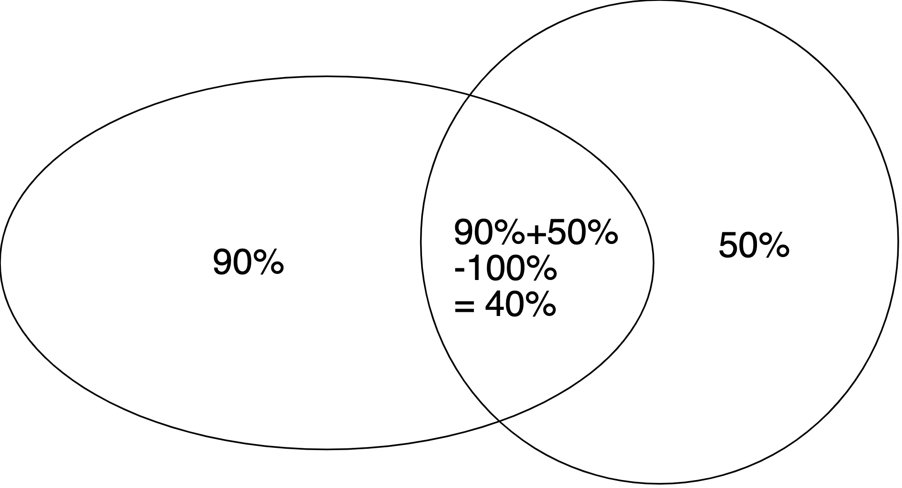

# Zählen

## Summenregel

*Beispiel:* Jemand kann sich ein Projekt aus drei Listen anbieten. Die erste Liste hat 3 Einträge, die zweite hat 5 Einträge und die dritte hat 9 Einträge. Keines der Projekte kommt in mehreren Listen vor.

Die Person kann sich also zwischen 3 + 5 + 9 = 17 Projekten entscheiden.

Definition:

`|A1 ∪ A2 ∪ . . . ∪ Ak|` = `|A1| + |A2| + ... + |Ak|`  

*|A| = Anzahl der Elemente der Menge A*  
*∪ = Vereinigung, also ODER*  
*Das funktioniert nur für disjunkte Mengen, also dürfen sich keine Elemente doppeln*

## Produktregel

*Beispiel:* Es gibt 3 unterschiedliche Routen von Konstanz nach München und 4 unterschiedliche von München nach Wien.

Also gibt es 3 * 4 = 12 unterschiedliche Routen von Konstanz über München nach Wien.

Definition:

`|A1 × A2 × ... × Ak|` = `|A1| * |A2| * ... * |Ak|`  
In anderen Worten: Die Anzahl der kombinierten Möglichkeiten ist das Produkt der Möglichkeitengruppen.

*Beispiel:* Eine Telefonnummer besteht aus diesem Muster:  
`NYX-NNX-XXXX` mit `N ∈ {2 .. 9}`, `X ∈ {0 .. 9}`, `Y ∈ {0, 1}`  

Wie viele unterschiedliche Telefonummern kann es geben?

*Lösung:*  
`|N| = 8`, `|X| = 10`, `|Y| = 2`

`|N| * |Y| * |X| * |N| * |N| * |X| * |X| * |X| * |X| * |X|`

= `8 * 2 * 10 * 8 * 8 * 10 * 10 * 10 * 10 * 10`

= __`1_024_000_000`__

## Das Einschluss-Ausschluss Prinzip
*Beispiel:* In einer Stadt mit 1000 Einwohnern sprechen 90% Deutsch und 50% Englisch.
Also sprechen 400 Einwohner beide Sprachen, da

`90% von 1000 = 900`

`50% von 1000 = 500`

`900 + 500 - 1000 = 400`

Definition für 2 Mengen:

`|A1 ∪ A2|` = `|A1| + |A2| - |A1 ∩ A2|`

Also in anderen Worten: Die Größe der Vereinigung von 2 Mengen ist die Summen der beiden Mengen minus die Schnittmenge der beiden Mengen.

Definition für 3 Mengen:

`|A1 ∪ A2 ∪ A3|` = `|A1| + |A2| + |A3| - |A1 ∩ A2| - |A1 ∩ A3| - |A2 ∩ A3| + |A1 ∩ A2 ∩ A3|`

In anderen Worten: Alle zusammenrechnen, die 2-er Schnittmengen abziehen und die Gesamtvereinigung drauf rechnen.
*Das gibt es auch für mehr Mengen, ist aber schwieriger darzustellen.*

Das Einschluss-Ausschluss Prinzip ist eine Verallgemeinerung der Summenregel.

___
[Nächstes: Prädikatenlogik](/kombinatorik/taubenschlag.md)